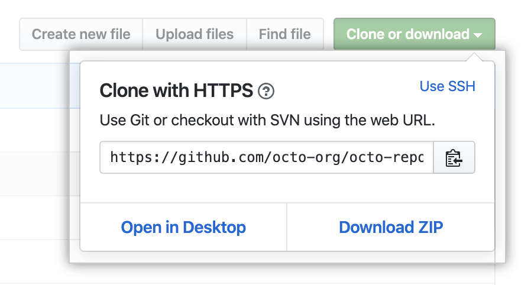
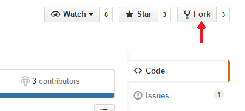
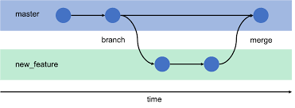
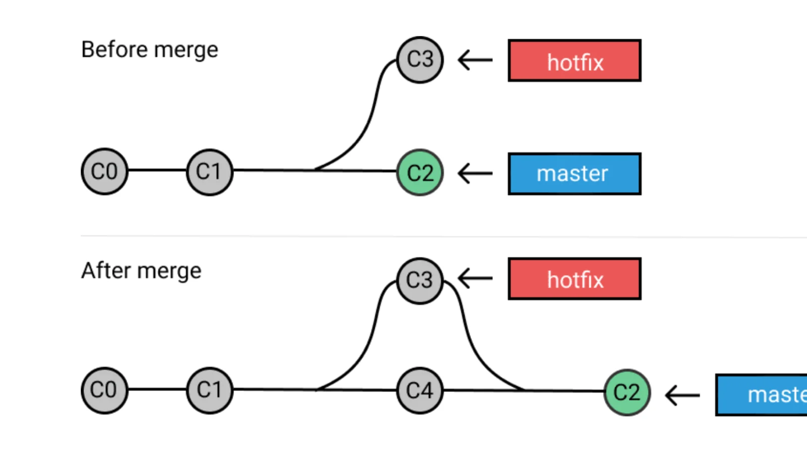

# Definition:

**Repository**: 
A directory or storage space where your projects can live. Sometimes GitHub users shorten this to “repo.” 
 

**Clone**: 
Process of downloading an already presented git repository to your local system.

**Fork**: 
Is producing a personal copy of someone else's project.

**Branch**: 
Is essentially is a unique set of code changes with a unique name. Each repository can have one or more branch.

**Commit**: 
Is an individual change to a file or set of files. When you make a commit to save your work, Git creates a unique ID ("SHA" or "hash") that allows you to keep record of the specific changes commited along with who made them and when.

**Merge**: 
Merging takes the changes from one branch (in the same repository or from a fork), and applies them into another. This often happens as a "pull request" (which can be thought of as a request to merge), or via the command line.

**Checkout**: 
You can use git checkout on the command line to create a new branch, change your current working branch to a different branch, or even to switch to a different version of a file from a different branch with git checkout [branchname] [path to file].

**Remote Add**: 
command on the terminal, in the directory your repository is stored at.
